# 🚀 Mini Project: EC2 MODULE and SECURITY GROUP MODULE with APACHE2 USER DATA

## 📌 Objective

Deploy an Apache HTTP web server on an AWS EC2 instance using Terraform modules, custom VPC configuration, and secure networking—all within Free Tier eligible resources.

## 📋 Table of Contents

* [Objective](#-objective)
* [Prerequisites](#-prerequisites)
* [Project Structure](#-project-structure)
* [Modules Used](#-modules-used)
* [Scripts Used](#-scripts-used)
* [Terraform Configurations](#-terraform-configurations)
* [Step-by-Step Guide](#-step-by-step-guide)
* [Expected Output](#-expected-output)
* [Challenges Encountered](#-challenges-encountered)
* [Screenshots](#-screenshots)
* [Cleanup](#-cleanup)

---

## ✅ Prerequisites

* AWS CLI installed and configured
* Terraform installed (v1.0+)
* AWS IAM User with programmatic access and permissions for EC2, VPC, and Networking
* An AWS named profile configured in your AWS CLI credentials

```bash
aws configure --profile terraform-needs-891377184590
```

---

## 📁 Project Structure

```bash
terraform-ec2-apache/
├── apache_userdata.sh
├── main.tf
├── README.md
├── modules/
│   ├── ec2/
│   │   ├── main.tf
│   │   └── variables.tf
│   └── security_group/
│       ├── main.tf
│       └── variables.tf
```

---

## 📦 Modules Used

### 🔹 EC2 Module

* Launches a `t2.micro` instance
* Assigns security group
* Uses user data script to install Apache

### 🔹 Security Group Module

* Allows inbound HTTP (80) and SSH (22)
* Attaches to VPC provided via input variable

---

## 📝 Scripts Used

### `apache_userdata.sh`

```bash
#!/bin/bash
sudo yum update -y
sudo yum install -y httpd
sudo systemctl start httpd
sudo systemctl enable httpd
echo "<h1>Hello World from $(hostname -f)</h1>" | sudo tee /var/www/html/index.html
```

---

## ⚙️ Terraform Configurations

### 🔸 `main.tf`

Includes:

* Provider configuration
* Custom VPC and subnet creation
* Module calls for EC2 and Security Group
* Route table and internet gateway setup

---

## 🛠️ Step-by-Step Guide

### 🔹 Step 1: Configure AWS CLI Profile

```bash
aws configure --profile terraform-needs-891377184590
```

Provide access key, secret key, region (us-east-1), and output format.

### 🔹 Step 2: Set Up Project Structure

Create folders and files:

```bash
mkdir terraform-ec2-apache
cd terraform-ec2-apache
mkdir -p modules/ec2 modules/security_group
```
* >> 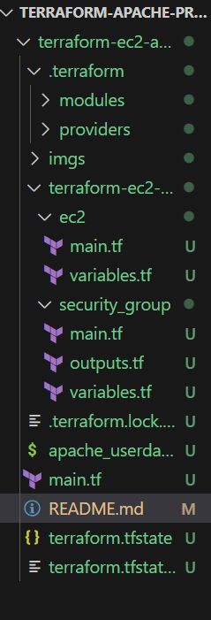

Create the following files:

* `main.tf`
 >> 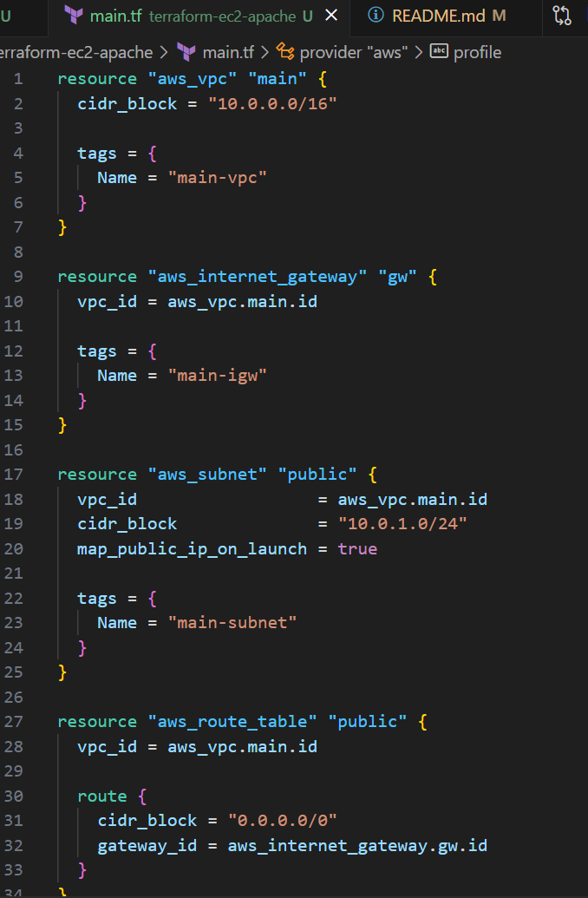
```
resource "aws_vpc" "main" {
  cidr_block = "10.0.0.0/16"

  tags = {
    Name = "main-vpc"
  }
}

resource "aws_internet_gateway" "gw" {
  vpc_id = aws_vpc.main.id

  tags = {
    Name = "main-igw"
  }
}

resource "aws_subnet" "public" {
  vpc_id                  = aws_vpc.main.id
  cidr_block              = "10.0.1.0/24"
  map_public_ip_on_launch = true

  tags = {
    Name = "main-subnet"
  }
}

resource "aws_route_table" "public" {
  vpc_id = aws_vpc.main.id

  route {
    cidr_block = "0.0.0.0/0"
    gateway_id = aws_internet_gateway.gw.id
  }
}

resource "aws_route_table_association" "public" {
  subnet_id      = aws_subnet.public.id
  route_table_id = aws_route_table.public.id
}

module "security_group" {
  source = "C:/Users/Oluwatobi/Desktop/terraform-apache-projects/terraform-ec2-apache/terraform-ec2-apache/modules/security_group"
  vpc_id = aws_vpc.main.id
}

module "ec2" {
  source            = "C:/Users/Oluwatobi/Desktop/terraform-apache-projects/terraform-ec2-apache/terraform-ec2-apache/modules/ec2"
  security_group_id = module.security_group.security_group_id
  subnet_id         = aws_subnet.public.id
  user_data         = file("${path.module}/apache_userdata.sh")
}

provider "aws" {
  region  = "us-east-1"
  profile = "terraform-needs-891377184590"
}
```
* `apache_userdata.sh` >> 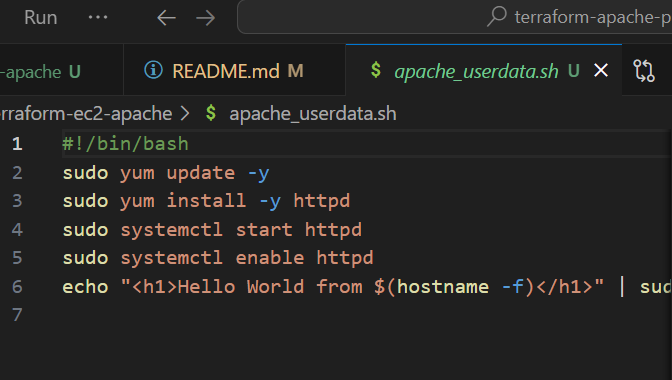

```
#!/bin/bash
sudo yum update -y
sudo yum install -y httpd
sudo systemctl start httpd
sudo systemctl enable httpd
echo "<h1>Hello World from $(hostname -f)</h1>" | sudo tee /var/www/html/index.html
```

* `modules/ec2/main.tf` >> 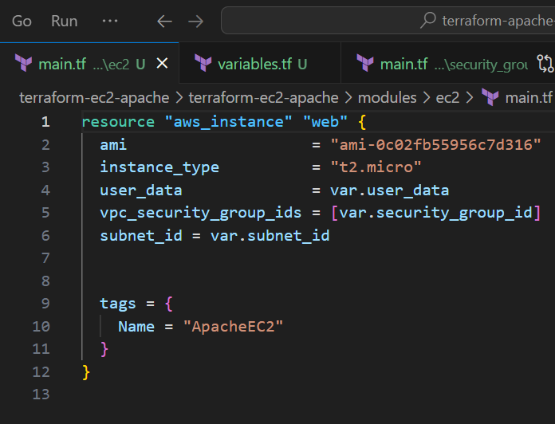

```
resource "aws_instance" "web" {
  ami                    = "ami-0c02fb55956c7d316"  # Amazon Linux 2 (Free tier in us-east-1)
  instance_type          = "t2.micro"
  user_data              = var.user_data
  vpc_security_group_ids = [var.security_group_id]
  subnet_id = var.subnet_id


  tags = {
    Name = "ApacheEC2"
  }
}
```

 `variables.tf` >> 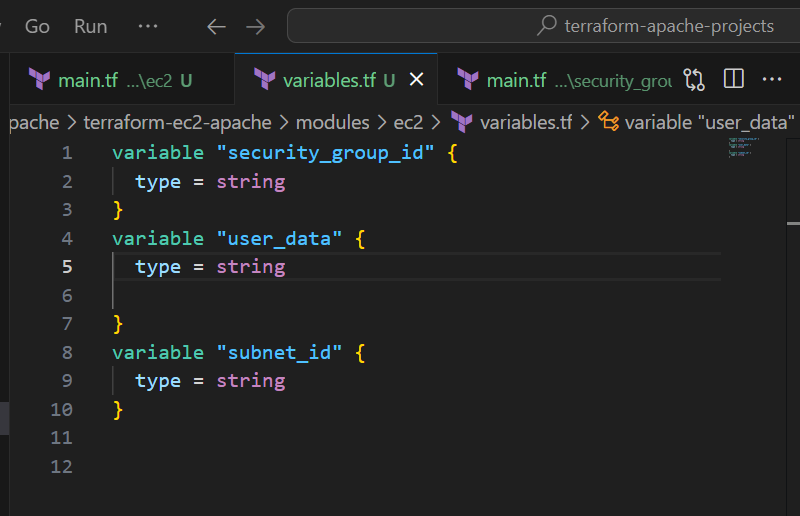

 ```
 variable "security_group_id" {
  type = string
}
variable "user_data" {
  type = string

}
variable "subnet_id" {
  type = string
}
```

* `modules/security_group/main.tf` >> 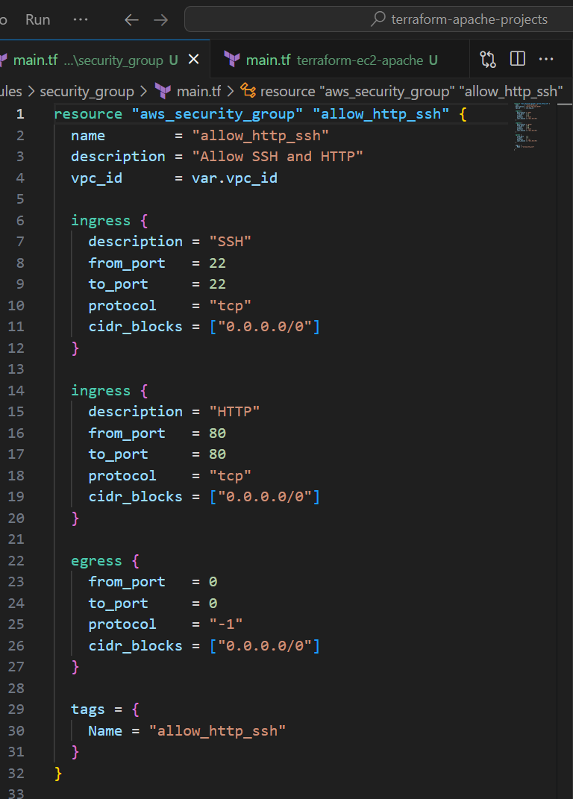

```
resource "aws_security_group" "allow_http_ssh" {
  name        = "allow_http_ssh"
  description = "Allow SSH and HTTP"
  vpc_id      = var.vpc_id
  
  ingress {
    description = "SSH"
    from_port   = 22
    to_port     = 22
    protocol    = "tcp"
    cidr_blocks = ["0.0.0.0/0"]
  }

  ingress {
    description = "HTTP"
    from_port   = 80
    to_port     = 80
    protocol    = "tcp"
    cidr_blocks = ["0.0.0.0/0"]
  }

  egress {
    from_port   = 0
    to_port     = 0
    protocol    = "-1"
    cidr_blocks = ["0.0.0.0/0"]
  }

  tags = {
    Name = "allow_http_ssh"
  }
}
```

 `variables.tf` >> 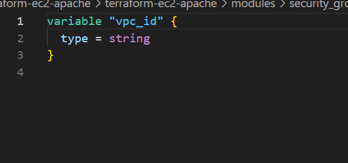

 ```
 variable "vpc_id" {
  type = string
}
```


### 🔹 Step 3: Write User Data Script

Paste the `apache_userdata.sh` script to install Apache.
```
#!/bin/bash
sudo yum update -y
sudo yum install -y httpd
sudo systemctl start httpd
sudo systemctl enable httpd
echo "<h1>Hello World from $(hostname -f)</h1>" | sudo tee /var/www/html/index.html
```

### 🔹 Step 4: Define Terraform Provider and VPC in `main.tf`

Set up AWS provider, VPC, subnet, IGW, route table, and association.
```
resource "aws_vpc" "main" {
  cidr_block = "10.0.0.0/16"

  tags = {
    Name = "main-vpc"
  }
}

resource "aws_internet_gateway" "gw" {
  vpc_id = aws_vpc.main.id

  tags = {
    Name = "main-igw"
  }
}

resource "aws_subnet" "public" {
  vpc_id                  = aws_vpc.main.id
  cidr_block              = "10.0.1.0/24"
  map_public_ip_on_launch = true

  tags = {
    Name = "main-subnet"
  }
}

resource "aws_route_table" "public" {
  vpc_id = aws_vpc.main.id

  route {
    cidr_block = "0.0.0.0/0"
    gateway_id = aws_internet_gateway.gw.id
  }
}

resource "aws_route_table_association" "public" {
  subnet_id      = aws_subnet.public.id
  route_table_id = aws_route_table.public.id
}

module "security_group" {
  source = "C:/Users/Oluwatobi/Desktop/terraform-apache-projects/terraform-ec2-apache/terraform-ec2-apache/modules/security_group"
  vpc_id = aws_vpc.main.id
}

module "ec2" {
  source            = "C:/Users/Oluwatobi/Desktop/terraform-apache-projects/terraform-ec2-apache/terraform-ec2-apache/modules/ec2"
  security_group_id = module.security_group.security_group_id
  subnet_id         = aws_subnet.public.id
  user_data         = file("${path.module}/apache_userdata.sh")
}

provider "aws" {
  region  = "us-east-1"
  profile = "terraform-needs-891377184590"
}
```
### 🔹 Step 5: Create Security Group Module

Define a reusable SG module that accepts `vpc_id` as input and allows HTTP/SSH.
```
resource "aws_security_group" "allow_http_ssh" {
  name        = "allow_http_ssh"
  description = "Allow SSH and HTTP"
  vpc_id      = var.vpc_id
  
  ingress {
    description = "SSH"
    from_port   = 22
    to_port     = 22
    protocol    = "tcp"
    cidr_blocks = ["0.0.0.0/0"]
  }

  ingress {
    description = "HTTP"
    from_port   = 80
    to_port     = 80
    protocol    = "tcp"
    cidr_blocks = ["0.0.0.0/0"]
  }

  egress {
    from_port   = 0
    to_port     = 0
    protocol    = "-1"
    cidr_blocks = ["0.0.0.0/0"]
  }

  tags = {
    Name = "allow_http_ssh"
  }
}
```

### 🔹 Step 6: Create EC2 Module

Define a module that accepts `subnet_id`, `security_group_id`, and `user_data`.
```
resource "aws_instance" "web" {
  ami                    = "ami-0c02fb55956c7d316"  # Amazon Linux 2 (Free tier in us-east-1)
  instance_type          = "t2.micro"
  user_data              = var.user_data
  vpc_security_group_ids = [var.security_group_id]
  subnet_id = var.subnet_id


  tags = {
    Name = "ApacheEC2"
  }
}
```

### 🔹 Step 7: Reference Modules in `main.tf`

Call both modules, passing required arguments and linking outputs properly.

### 🔹 Step 8: Initialize Terraform

```bash
terraform init
```
>> 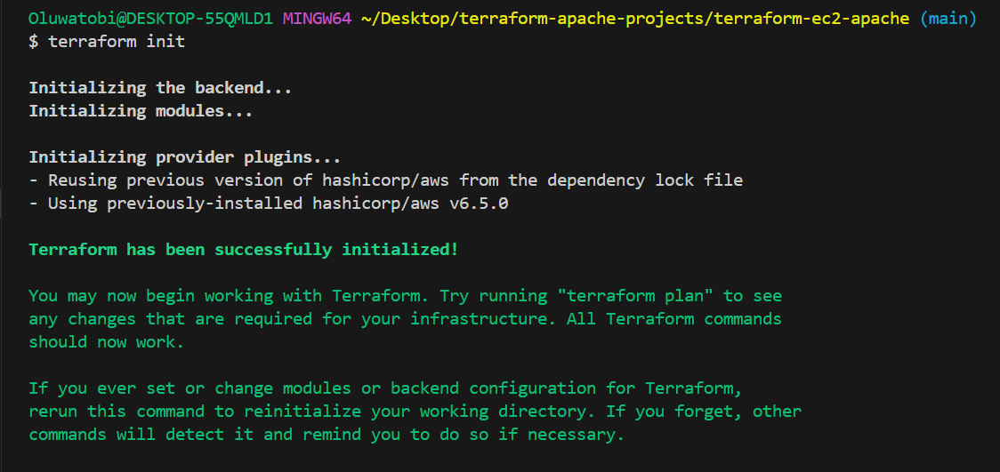

### 🔹 Step 9: Review the Execution Plan

```bash
terraform plan
```
>> 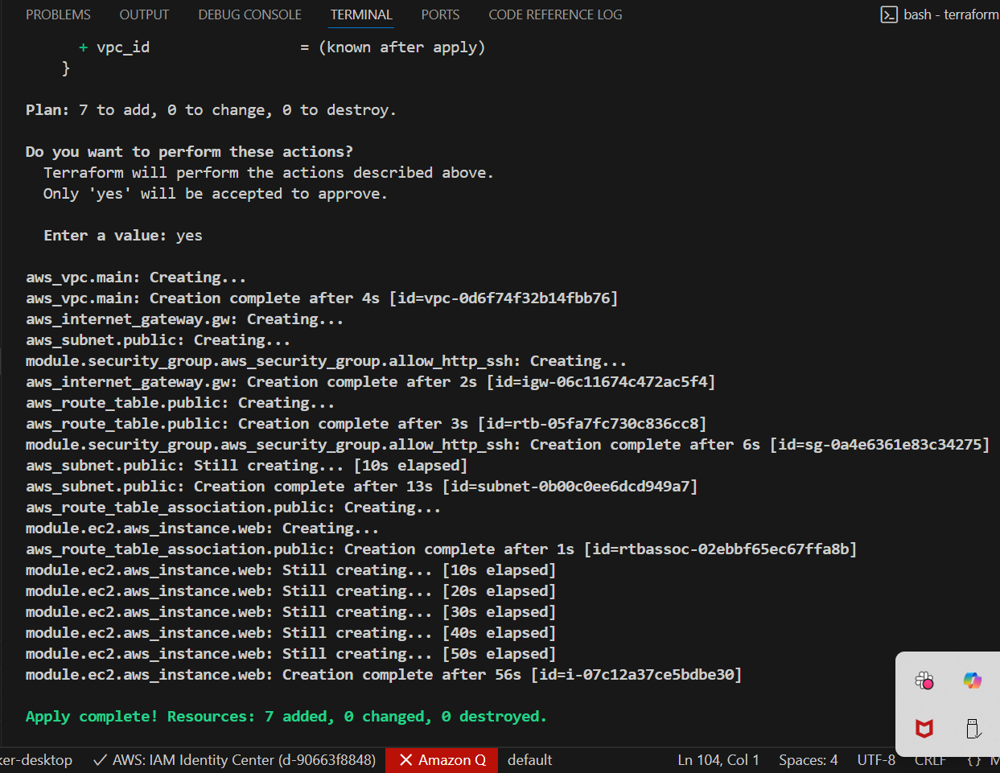

### 🔹 Step 10: Apply Configuration

```bash
terraform apply
```
>> 

Type `yes` to confirm and create the resources.

### 🔹 Step 11: Access EC2 Instance

Find the public IP of your EC2 instance using:

```bash
aws ec2 describe-instances \
  --query "Reservations[*].Instances[*].PublicIpAddress" \
  --output text \
  --region us-east-1 \
  --profile terraform-needs-891377184590
```
>> 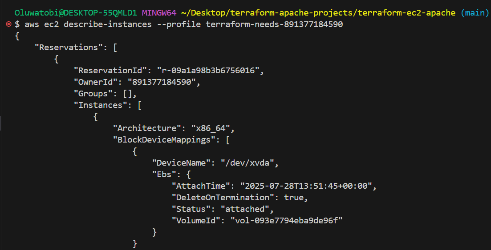

Paste the IP in your browser:

```
http://54.236.47.37/
```

---

## 🎯 Expected Output

* A running EC2 instance with Apache HTTP server
* Public IP accessible in browser
* Page content:

```html
<h1>Hello World from ip-...</h1>
```
>> 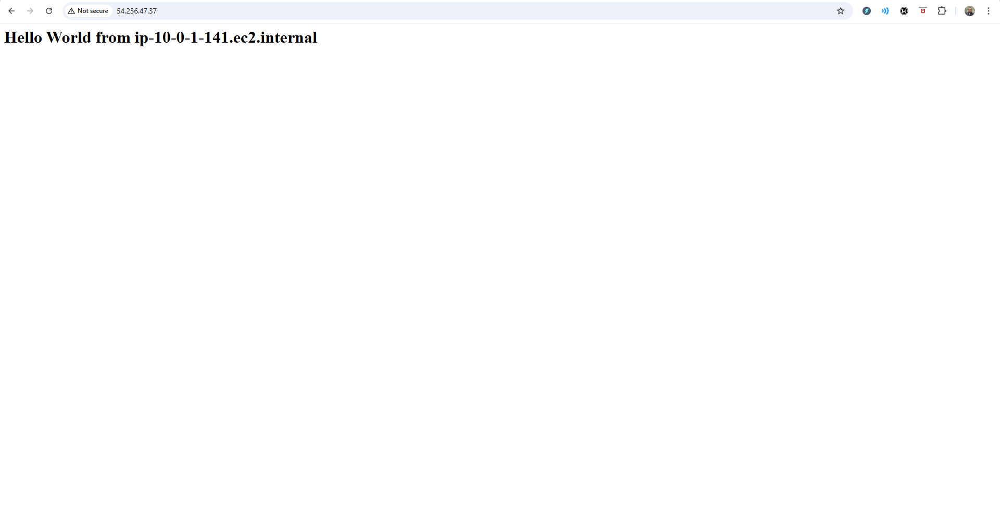
>> 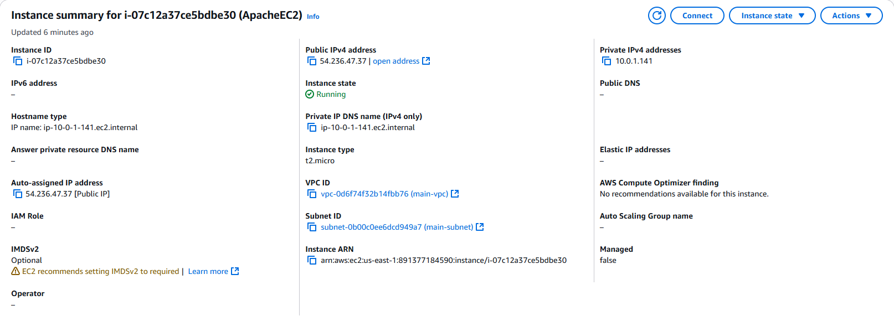
---

## ⚠️ Challenges Encountered

* **No default VPC**: Required creating a custom VPC with subnet, route table, and IGW
* **Module file references**: `file()` cannot access paths outside `.terraform/modules/`, so user data was passed as a variable
* **Windows path handling**: Ensured backslashes didn’t break Terraform module sourcing

---

## 🖼️ Screenshots

> 📸 **Screenshot 1:** AWS Console showing EC2 instance


> 📸 **Screenshot 2:** Web browser showing Apache Hello World page


> 📸 **Screenshot 3:** Terminal output of `terraform apply`


---

## 🧹 Cleanup

To avoid unnecessary AWS charges:

```bash
terraform destroy
```

Type `yes` when prompted.

>> 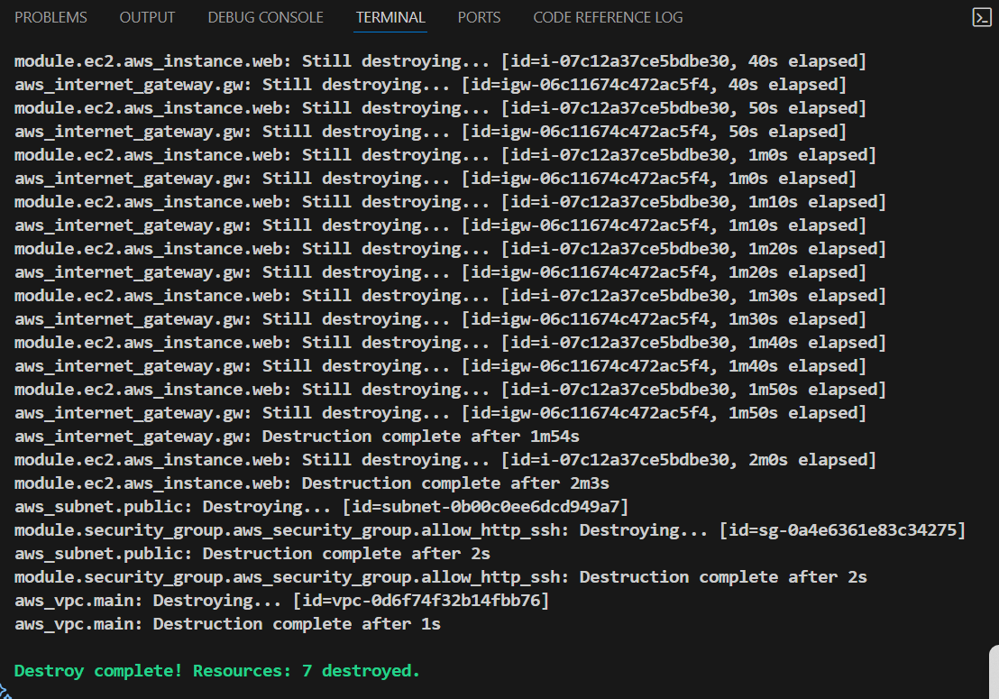

---

## 🏁 Conclusion

This project demonstrates the power of infrastructure-as-code using Terraform. By modularizing resources, managing a custom VPC, and automating provisioning, we achieve a reproducible and scalable cloud deployment workflow — all within AWS Free Tier.

---

## 📎 Author

**Samuel Oluwatobi Olofinkuade**
Github Repo | https://github.com/Techytobii/terraform-ec2-apache.git

Terraform | AWS | DevOps